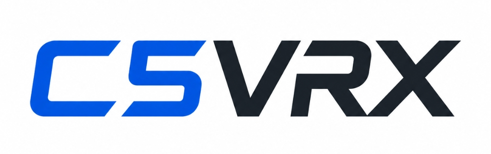

<div align="center">
  

  <p><strong>ESP32-C5 analog 5.8 GHz FPV receiver research</strong></p>
  <p>An open-source attempt to turn commodity ESP32-C5 hardware into a tiny <strong>RX5808-class analog CVBS receiver</strong>.</p>

  <p>
    
    
    
    
    
  </p>
</div>

---

## The decision: analog first, analog out

C5VRX is intentionally **not** trying to become a tiny software video player.
The primary product target is a classic low-latency analog receiver:

```text
5.8 GHz analog FPV VTX
          │
          ▼
   ESP32-C5 RF front-end
          │
          ▼
      complex I/Q
          │
          ▼
 hardware-assisted WBFM
          │
          ▼
 sampled composite video
          │
          ▼
 PARLIO + 6-bit resistor DAC
          │
          ▼
      75-ohm CVBS OUT
```

The important shortcut is that WBFM demodulation already recovers the composite
PAL/NTSC waveform. A normal analog monitor, DVR or goggles can decode that
waveform themselves, so C5VRX does **not** need a framebuffer, RGB conversion,
full PAL/NTSC pixel decoder or LCD controller in the main path.

Digital display remains secondary. The implemented USB-C preview is a reduced
160×120 grayscale diagnostic derived from the streaming CVBS samples; it has
independent buffers and may be stopped or disconnected without owning PARLIO AV.

See [`research/analog-first-architecture.md`](research/analog-first-architecture.md).

---

## Output proof you can build before RF works

The output half has its own reproducible hardware test. The firmware can boot in
an **output-only PAL mode** that skips RF/Wi-Fi and continuously streams a
625/50 monochrome test raster through PARLIO/GDMA into a six-bit passive DAC.

```text
C5 RAM
  -> double-buffered PAL raster
  -> PARLIO/GDMA @ 20 MS/s
  -> GPIO0/1/6/8/9/10
  -> 6-bit source-matched resistor DAC
  -> 75-ohm CVBS input
```

Use [`sdkconfig.defaults.cvbs`](sdkconfig.defaults.cvbs) for the dedicated image
and follow [`research/devkit-cvbs-proof.md`](research/devkit-cvbs-proof.md) for
the exact resistor values, pin wiring and scope checklist.

The DevKitC CI artifact is named `c5vrx-pal-cvbs-proof-firmware`. It displays a
12-second C5VRX splash followed by a grayscale calibration screen. The separate
XIAO artifact is `c5vrx-xiao-pal-cvbs-proof-firmware`; use
[`research/xiao-c5-cvbs-proof.md`](research/xiao-c5-cvbs-proof.md), not the
DevKitC pin map. An optional 4.43361875 MHz swinging burst is included only as an
analog bandwidth/lock stress signal; it is not a claim of complete PAL color
encoding.

For the **full RF diagnostics, live pipeline and USB preview on a Seeed Studio
XIAO ESP32-C5**, use `c5vrx-xiao-receiver-console-firmware` or the board-specific
`C5VRX-XIAO-Receiver-Console-Windows` artifact. The ordinary
`C5VRX-Receiver-Console-Windows` remains the DevKitC/WROOM build and must not be
used for XIAO AV wiring.

A host-side golden model in [`tools/pal_cvbs_reference.py`](tools/pal_cvbs_reference.py)
checks line/field timing, vertical sync, active-line count and DMA chunk wrap.
[`tools/minimal_cvbs_dac.py`](tools/minimal_cvbs_dac.py) separately validates the
ideal source-matched resistor network.

---

## How to wire the resistor DAC to AV out

The reference DevKitC and Receiver Console profiles use six GPIOs as the bits of
one passive video DAC. **Each GPIO needs its own complete series resistance
before the six branches meet.** Do not join the GPIOs directly, and do not
connect any of these resistors to 3.3 V.

| DAC bit | GPIO | Required series resistance | 1206 kit series chain |
|---|---:|---:|---:|
| D0 / LSB | GPIO0 | 7.87 kΩ | 7.5 kΩ + 360 Ω + 10 Ω |
| D1 | GPIO1 | 3.92 kΩ | 3.9 kΩ + 20 Ω |
| D2 | GPIO6 | 1.96 kΩ | 1.8 kΩ + 160 Ω |
| D3 | GPIO8 | 976 Ω | 910 Ω + 62 Ω + 3.9 Ω = 975.9 Ω |
| D4 | GPIO9 | 487 Ω | 470 Ω + 16 Ω + 1 Ω |
| D5 / MSB | GPIO10 | 243 Ω | 240 Ω + 3 Ω |
| Shunt | VIDEO to GND | 191 Ω | 180 Ω + 11 Ω |

The resistor values and D0-to-D5 order are identical on every profile, but the
GPIOs are board-specific. **For a Seeed Studio XIAO ESP32-C5 running the XIAO
Receiver Console artifact, replace the GPIO column above with this table:**

| DAC bit | XIAO header pin | ESP32-C5 GPIO | Required series resistance |
|---|---:|---:|---:|
| D0 / LSB | D4 | GPIO23 | 7.87 kΩ |
| D1 | D5 | GPIO24 | 3.92 kΩ |
| D2 | D6 / TX | GPIO11 | 1.96 kΩ |
| D3 | D7 / RX | GPIO12 | 976 Ω |
| D4 | D8 / SCK | GPIO8 | 487 Ω |
| D5 / MSB | D9 / MISO | GPIO9 | 243 Ω |

This XIAO map leaves native USB GPIO13/14, battery-sense GPIO6/26, BOOT GPIO28
and the strapping pins GPIO7/25 untouched. D6/GPIO11 and D7/GPIO12 are UART0
alternates, so a brief non-video transient can occur during reset before
PARLIO takes control. Do not connect the resistor network to XIAO D0–D3 or D10.

The logical pin map above has been checked against the ESP32-C5 GPIO matrix,
the ESP32-C5-WROOM-1/1U module pinout and both official DevKitC revisions. For
the **supported ESP32-C5-DevKitC-1 v1.2**, the physical connections are:

| DAC bit | GPIO label | DevKitC-1 v1.2 header | WROOM-1/1U module pad |
|---|---:|---:|---:|
| D0 / LSB | GPIO0 | J1 pin 5 | IO0, pad 6 |
| D1 | GPIO1 | J1 pin 6 | IO1, pad 7 |
| D2 | GPIO6 | J1 pin 7 | IO6, pad 8 |
| D3 | GPIO8 | J1 pin 9 | IO8, pad 10 |
| D4 | GPIO9 | J1 pin 10 | IO9, pad 11 |
| D5 / MSB | GPIO10 | J1 pin 11 | IO10, pad 12 |

Use the **GPIO label printed beside the header** as the primary identifier.
DevKitC-1 v1.1 placed several of these same logical GPIOs at different J1/J3
positions. More importantly, Espressif documents that v1.1 contains C5 chip
revision v0.1, while the pinned ESP-IDF v6.0.2 C5VRX image requires chip
revision >= v1.0. Do not use the v1.2 header-position table—or the current
C5VRX firmware—on a v1.1 board.

The selected v1.2 pins are ordinary GPIO-matrix outputs. None is a C5 boot
strapping pin, native USB uses GPIO13/14 instead, and the module exposes all six
pins. PARLIO is configured with `data_gpio_nums[0..5]` in exactly the order
shown and sends 8-bit samples whose upper two bits are zero, so D0/GPIO0 is the
least-significant contribution and D5/GPIO10 the most-significant contribution.

Resistors shown with `+` are soldered **end-to-end in series**. Their order
inside a branch does not matter. For example, the D0 branch is
`GPIO0 -> 7.5 kΩ -> 360 Ω -> 10 Ω -> VIDEO`. Build and measure every chain
separately before joining its VIDEO end to the common node.

```text
GPIO0  -- 7.5k -- 360R -- 10R --------+
GPIO1  -- 3.9k --------- 20R ----------+
GPIO6  -- 1.8k -------- 160R ----------+
GPIO8  --  910R -- 62R -- 3.9R --------+---- VIDEO ---- AV signal/center
GPIO9  --  470R -- 16R ---- 1R --------+
GPIO10 --  240R ---------- 3R ---------+
                                          |
                                        180R
                                          |
                                         11R
                                          |
ESP32-C5 GND -----------------------------+---- AV ground/shield
```

The 191 Ω chain is different from the six GPIO branches: it connects the
finished `VIDEO` summing node to ground. The AV connector's signal contact also
connects to `VIDEO`, and its ground/shield connects to an ESP32-C5 GND pin. A
common ground is mandatory. For RCA, these are normally center and outer shell.
For a 3.5 mm/TRRS HDZero cable, verify the actual cable/breakout pinout with its
documentation or a continuity meter—tip/ring assignments are not universal.

The receiving monitor, DVR or goggles should provide the normal **75 Ω input
termination**. Do not add another 75 Ω resistor on the C5VRX board: two 75 Ω
terminations in parallel load the DAC with 37.5 Ω and halve the intended level
again. When testing without a monitor, a single 75 Ω termination at the scope
input emulates the receiver. A high-impedance 1 MΩ scope input is useful for
inspection but will show roughly 2 V open-circuit full scale instead of the
approximately 1 V expected into 75 Ω.

Prototype construction matters at the 20 MS/s edge rate:

1. Power off the board and verify the value of every resistor chain with a
   multimeter before connecting all seven branches.
2. Keep the common VIDEO node, ground return and AV lead short; avoid a large
   solderless breadboard and long flying wires where possible.
3. Check that VIDEO is not shorted to 3.3 V or directly to any GPIO.
4. Start with the output-only PAL firmware and a scope terminated once at 75 Ω.
   Expect sync near 0 V, blank near 0.30 V, black near 0.32 V and white near
   1.0 V. These are measurement targets, not guaranteed uncalibrated values.
5. Only connect the HDZero/monitor AV input after the loaded waveform and ground
   wiring look correct. Never connect a raw 3.3 V GPIO directly to AV input.

The DevKitC table applies only to the ordinary Receiver Console profile. The
XIAO Receiver Console uses the separately verified mapping shown above; follow
[`research/xiao-c5-cvbs-proof.md`](research/xiao-c5-cvbs-proof.md) while keeping
the same resistor values and VIDEO-node topology. The more detailed scope test
is in [`research/devkit-cvbs-proof.md`](research/devkit-cvbs-proof.md). Official
pin references: [DevKitC-1 v1.2 header table](https://docs.espressif.com/projects/esp-dev-kits/en/latest/esp32c5/esp32-c5-devkitc-1/user_guide.html#header-block),
[WROOM-1/1U pin definitions](https://documentation.espressif.com/esp32-c5-wroom-1_wroom-1u_datasheet_en.html),
and [XIAO ESP32-C5 pin map](https://wiki.seeedstudio.com/xiao_esp32c5_getting_started/#pin-map).

---

## Standalone receiver hardware target

The first custom receiver PCB should use **ESP32-C5-WROOM-1U-N4** rather than a
bare C5. That keeps the first board focused on proving the receiver instead of
simultaneously debugging a custom 5.8 GHz RF/crystal/flash implementation.

The recommended standalone architecture is:

```text
USB-C 5 V
   |
3.3 V LDO
   |
ESP32-C5-WROOM-1U-N4 <--- external 5.8 GHz antenna
   |
6-bit passive CVBS DAC
   |
AV视频 / RCA OUT
```

Complete BOM:

- [`hardware/analog-vrx-bom.md`](hardware/analog-vrx-bom.md) — design notes,
  wiring and functional-minimum versus standalone product BOM;
- [`hardware/analog-vrx-bom.csv`](hardware/analog-vrx-bom.csv) — machine-readable
  BOM for PCB/CAD work.

The functional minimum can be one active C5 module in the signal path plus the
video ladder and normal power/reset passives.

---

## Why C5VRX?

Analog FPV still depends heavily on old 5.8 GHz receiver silicon such as
**RX5808 / RTC6715**. The ESP32-C5 is cheap, tiny and contains a real 2.4 +
5 GHz Wi-Fi RF chain.

C5VRX asks:

> **Can we bypass enough of the Wi-Fi PHY to use the C5 RF chain as a low-cost analog FPV receiver and reconstruct CVBS with almost no external active hardware?**

The long-term minimal hardware target is deliberately aggressive:

```text
ESP32-C5 / C5 module
power + decoupling
antenna / RF connection
6-bit weighted resistor DAC
AV connector
```

No RX5808. No external video decoder. No external video DAC. No AT7456E-class
OSD chip. No USB-UART bridge on a native-USB design.

---

## Current status

> **C5VRX is still experimental and is not yet a working analog FPV receiver.**

Static reverse engineering of Espressif's ESP32-C5 ESP-IDF v6.0.2 RF-test
binaries identifies a real finite complex-sample capture path:

```text
set_dump_mode()
      ↓
adctrig()
      ↓
0x40830000 dump RAM
      ↓
print_dump_data() / accumiq()
```

The vendor code decodes each 32-bit dump word as signed 10-bit I and Q samples:

```text
31                              20 19          10 9            0
┌────────────────────────────────┬──────────────┬──────────────┐
│      status / internal bits    │ I signed 10b │ Q signed 10b │
└────────────────────────────────┴──────────────┴──────────────┘
```

Recovered dump RAM:

```text
base: 0x40830000
size: 0x10000 bytes = 64 KiB
max:  16,384 complex samples
```

The source-level producer and guarded ring reader are implemented. The decisive
RF problem is now whether real C5 silicon produces phase-bearing data with
enough bandwidth, cadence and coherent continuity through ring wrap.

See [`research/adc-dump-format.md`](research/adc-dump-format.md),
[`research/reverse-engineering.md`](research/reverse-engineering.md) and
[`research/live-rx-pipeline.md`](research/live-rx-pipeline.md).

---

## FPV frequency coverage

The current direct C5 target window is **5645–5885 MHz**.

| Ch | A | B | E | F | R |
|---:|:---:|:---:|:---:|:---:|:---:|
| 1 | ✅ | ☑️ | ☑️ | ☑️ | ☑️ |
| 2 | ✅ | ☑️ | ☑️ | ☑️ | ☑️ |
| 3 | ✅ | ☑️ | ☑️ | ☑️ | ☑️ |
| 4 | ✅ | ☑️ | ☑️ | ☑️ | ☑️ |
| 5 | ✅ | ☑️ | ✅ | ☑️ | ☑️ |
| 6 | ✅ | ☑️ | ❌ | ☑️ | ☑️ |
| 7 | ✅ | ☑️ | ❌ | ☑️ | ☑️ |
| 8 | ☑️ | ☑️ | ❌ | ☑️ | ❌ |

**Legend:** ✅ exact normal 5 GHz Wi-Fi center · ☑️ inside target range, needs
offset/arbitrary tuning · ❌ outside current target window.

Seven Band-A channels line up exactly with normal 5 GHz Wi-Fi centers, making
them useful bring-up targets before undocumented PLL tuning is required.

---

## RF bring-up and arbitrary tuning

The default firmware uses the normal ESP-IDF Wi-Fi driver for supported 5 GHz
bring-up. Promiscuous Wi-Fi receive is only a supported way to put the RF chain
on a real 5 GHz center; it does **not** expose analog FPV samples by itself.

The C5 PHY also contains an undocumented two-argument frequency path recovered
from disassembly:

```c
extern void phy_set_freq(uint16_t freq_mhz, int offset);
```

For example:

```c
phy_set_freq(5806, 0);
```

This remains opt-in until physical hardware proves that it moves the actual
receiver center.

See [`research/frequency-tuning.md`](research/frequency-tuning.md).

---

## Finite I/Q and live-pipeline diagnostics

The XIAO Receiver Console keeps AV-out active from normal receiver boot. Its
PAL generator uses scanline rendering rather than a framebuffer and changes
content only at a complete frame boundary:

- `LOGO`: the RF backend has not produced an accepted sample block yet;
- `SNOW`: varying RF samples exist, but no gapless H/V-locked video exists;
- live video: reserved for a future continuous SRAM-safe producer.

Once the receiver enters `SNOW`, later gaps do not flash the logo over genuine
static. `STATUS` reports the on-wire state as `av_display=LOGO|SNOW|TEST`.
`CVBS TEST` selects the diagnostic raster and `CVBS STOP` returns to the logo;
neither command disables the physical AV signal.

### Test-readiness status

- **IMPLEMENTED / NOT PHYSICALLY TESTED:** modular RF block ABI, bounded queue,
  C5 BitScrambler WBFM, configurable sample conditioner, two-buffer PARLIO
  sink, branded PAL renderer, DevKitC and XIAO build profiles.
- **UNKNOWN UNTIL MEASURED ON HARDWARE:** RF sample validity/rate/gaps, conditioner
  calibration, 75-ohm DAC levels and real monitor/VTX behavior.
- **EXPERIMENTAL RING SOURCE UNPROVEN:** the guarded source exists, but physical
  cadence, wrap continuity, tap bandwidth and sustainable contention margin are
  still unknown.

> **Can the ESP32-C5 provide a sufficiently continuous, phase-bearing RF
> stream for real-time WBFM demodulation?**

See [`research/live-stream-architecture.md`](research/live-stream-architecture.md).
The exhaustive public-interface survey, binary audit and single-arm physical
falsification test are in
[`research/continuous-rf-verdict.md`](research/continuous-rf-verdict.md).
The focused answer on tap position, AGC/filtering, modes 0/11/12, likely rate
and whether analog-FPV WBFM survives is in
[`research/rf-iq-dump-verdict.md`](research/rf-iq-dump-verdict.md).

Recommended first physical target:

```text
VTX:       A4 / 5805 MHz
C5 center: Wi-Fi ch161 / 5805 MHz
BW:        40 MHz
retune:    OFF
```

The USB protocol exposes bounded producer, DSP and streaming diagnostics:

```text
CAPTURE 16384
CAPTURE PHASE8 16384
PRODUCER CADENCE PROBE ALL
WRAP FLAG PROBE 0
PHASE CONTINUITY PROBE 0
PRODUCER SOAK 0 30000
FINE TUNE VERIFY 5805 5807 <measured_rate_hz>
TONE RESPONSE PROBE 0 <signed_offset_hz> <measured_rate_hz>
WBFM HWTEST
BENCH SPARSE 2
BENCH SPARSE 4
BENCH SPARSE 8
BENCH BITSCRAMBLER
BENCH PARLIO
BENCH USB PREVIEW
BENCH PIPELINE
BENCH RING PIPELINE 0 1000 1024
BENCH RING PIPELINE 0 1000 2048
BENCH RING PIPELINE 0 1000 4096
LIVE START
LIVE EXPERIMENTAL START 0
LIVE STOP
USB PREVIEW START
USB PREVIEW STOP
CVBS LOCK STATUS
CVBS LOCK PROBE 5000
PIPELINE STATS
```

`CAPTURE` gets a real finite packed-I/Q block. `CAPTURE PHASE8` removes the
per-block I/Q DC offset on the C5 and sends one unsigned phase byte per sample,
reducing the finite USB payload from four bytes to one while leaving phase
difference, video synchronization and raster work on the PC. `CHAIN`
repeatedly retriggers the vendor dump and reports hashes plus boundary
discontinuity, explicitly testing whether finite captures are useful as a
temporary near-live source.

`LIVE START` uses measured capabilities and fails closed while rate, phase,
anti-alias bandwidth or processing margin is missing. Real XIAO testing also
proved that continuous MAC dump ownership makes normal HP-SRAM/FreeRTOS USB
execution unsafe. `LIVE EXPERIMENTAL START` therefore fails closed instead of
wedging native USB. The Receiver Console's safe preview repeatedly requests
bounded `CAPTURE PHASE8` blocks. The proven finite vendor capture runs in a
short critical section, validates sentinel replacement and signal variance,
then returns SRAM ownership before Phase8 encoding and USB transfer. This
bounded host preview does not make continuous AV output operational: that path
needs a dataplane which can keep processing and refilling PARLIO without
executing FreeRTOS code from MAC-owned HP-SRAM.

BitScrambler accelerates the WBFM phase-LUT/decimation transform, but its
ESP-IDF loopback interface still consumes input and output buffers. It reduces
CPU and transport load; it does not replace the RF dump buffer or make the
exclusive continuous HP-SRAM handoff safe.

Protocol 8 carries preview data in versioned binary packets with an eight-byte
magic marker, packet type, sequence, lengths, timestamp, header CRC and payload
CRC. Packet type 6 carries CRC-protected Phase8 capture chunks; the Receiver
Console selects it when firmware reports `phase8_capture=1` and otherwise
falls back to type-5 raw IQ. `STREAM_INFO`, `GRAY8_FRAME` and `STREAM_END`
packets allow clean startup, frame-loss reporting and resynchronisation after
corruption or disconnect. See
[`research/usb-preview-protocol.md`](research/usb-preview-protocol.md).

`CVBS LOCK PROBE 5000` is the bounded real-VTX qualification step. It reports
H/V event rates, adaptive line period, lock loss and completed/sent/dropped
preview frames. A VTX-on/off hash difference is not called usable IQ; that
label requires stable demodulated CVBS timing. The complete six-question
evidence ladder is in
[`research/real-rf-evidence-ladder.md`](research/real-rf-evidence-ladder.md).

`WBFM HWTEST` runs synthetic packed I/Q through the physical C5 BitScrambler and
compares its output with a CPU reference. `WBFM CAPTURE` bridges a real finite
vendor RF dump directly into that hardware WBFM transform.

`NEARLIVE START` exercises the complete bounded RF -> hardware WBFM ->
conditioner -> PARLIO route using repeated finite dumps. It is explicitly an
experimental finite/chained mode, not continuous capture.

For the first board test, use the USB-C lab runner instead of entering these by
hand. It automatically finds the C5 where possible, streams results live, and
creates a timestamped session plus a complete Codex ZIP bundle:

```bash
python -m pip install pyserial
python tools/c5vrx_lab.py auto-test
```

Run the bounded A4 / 5805 MHz VTX-off/on comparison with:

```bash
python tools/c5vrx_lab.py vtx-proof
```

Final stdout is machine-readable JSON and failures return a non-zero exit code.
Exact serial bytes, decoded logs, parsed measurements, IQ, preview frames,
firmware/Git identity, board profile, configuration and failures are retained.
The Receiver Console records the same session data and its **EXPORT CODEX
BUNDLE** button creates one ZIP. See
[`research/codex-hardware-lab.md`](research/codex-hardware-lab.md) and
[`research/first-hardware-test.md`](research/first-hardware-test.md) for the
artifact schema, one-button sequence, equipment, safety prompts and gates. The
legacy finite-only `tools/c5vrx_bench.py` runner remains available.

Decode serial captures on the host with:

```bash
python tools/decode_adc_dump.py capture.log --csv iq.csv --iq-bin iq.i16
python tools/wbfm_demod.py iq.i16 --dtype '<i2' --sample-rate 80000000 --output demod.f32
python tools/render_cvbs_lines.py iq.i16 --sample-rate 80000000 --output lines.pgm
```

The exact C5 capture sample rate still needs hardware verification.

---

## Analog CVBS output strategy

The mainline output target is:

```text
continuous phase-bearing RF samples
          ↓
4:1 hardware-assisted FM discriminator
          ↓
~20 MS/s biased phase-delta stream
          ↓
filter / polarity / level calibration
          ↓
~20 MS/s CVBS sample stream
          ↓
PARLIO + GDMA
          ↓
6 physical GPIO bits
          ↓
75-ohm weighted resistor DAC
          ↓
AV / goggles / DVR
```

PARLIO transports an 8-bit byte per sample while only six low data GPIOs are
physically connected. Six bits are the current reference compromise: useful
analog level resolution while still requiring only a handful of passives.

The existing `c5vrx_cvbs_out.c` experiment streams a full 625/50 interlaced
monochrome raster using two small DMA buffers rather than a complete framebuffer.

**Never connect raw 3.3 V GPIO outputs directly to a 75-ohm video input.**
Use the documented resistor network or another correctly scaled output stage.

---

## Hardware-assisted WBFM direction

A normal discriminator is:

```text
y[n] = angle(x[n] * conj(x[n-1]))
```

Doing that tens of millions of times per second on the CPU is unattractive.
C5VRX now has a C5 BitScrambler proof architecture instead.

```text
packed I10/Q10 words
       ↓
keep every fourth sample
       ↓
I5/Q5 -> 1024 x 16-bit phase LUT
       ↓
BitScrambler counter state
       ↓
32 + phase[n] - phase[n-1] modulo 64
       ↓
one output byte per four IQ words
```

If the recovered RF mode is physically confirmed as 80 MS/s, this architecture
maps naturally to the existing 20 MS/s CVBS path. The LUT occupies exactly the
C5's 2 KiB LUT RAM and is loaded once at initialization.

The assembly program is `main/c5vrx_wbfm_4to1.bsasm`; the C hardware bridge is
`main/c5vrx_wbfm_hw.c`; and `tools/validate_wbfm_bsasm.py` checks the numerical
architecture on the host.

This still does **not** claim continuous RF capture. A guarded ring source is
implemented, but cadence, coherent wrap continuity, tap bandwidth and sustained
bus margin remain first-silicon gates before it can be promoted to LIVE.

---

## What analog-first explicitly removes from the core design

The core receiver does **not** require these for its primary output target:

- a digital LCD or LCD controller;
- a full PAL/NTSC-to-RGB decoder;
- a full-frame video buffer;
- a UVC/high-speed USB video path;
- a separate video DAC IC;
- an AT7456E-style OSD chip.

Simple OSD remains possible later by modifying the recovered composite sample
stream after sync timing is known, without decoding the complete image to RGB.

---

## License

Except where otherwise identified, repository-authored source code, build
scripts, tests, tools and documentation are licensed under the
[GNU General Public License version 3 only](LICENSE), identified by
`GPL-3.0-only`.

The **C5VRX** name, logo (including `assets/c5vrx-logo.jpg`), distinctive visual
identity and other project branding are outside the software license. The GPL
does not grant permission to use those items as trademarks, to brand a modified
version as C5VRX, or to imply endorsement. See [BRANDING.md](BRANDING.md).

Third-party dependencies and components retain their own licenses and notices.
In particular, Espressif ESP-IDF, tools, libraries, headers and RF-test/PHY
components are not relicensed by this repository's GPL license. Distributors
must review and comply with the applicable third-party terms for the components
they use or include.

---

## Build

Requires ESP-IDF with ESP32-C5 support. CI currently targets ESP-IDF v6.0.2.

```bash
idf.py set-target esp32c5
idf.py menuconfig
idf.py build
idf.py flash monitor
```

Experimental hardware paths remain off by default in the normal firmware.
The deep-probe build exposes a fail-closed `LIVE START`: cadence, coherent wrap,
staged soak, measured anti-alias bandwidth and hardware throughput gates must
pass first. See [`research/first-hardware-test.md`](research/first-hardware-test.md).

There are two deliberately separate Receiver Console profiles:

- `sdkconfig.defaults.flasher` targets the 4 MB ESP32-C5 DevKitC/WROOM profile,
  uses GPIO0/1/6/8/9/10 and a 3 MiB factory-app partition.
- `sdkconfig.defaults.xiao_receiver_console` targets the Seeed Studio XIAO
  ESP32-C5, uses header D4–D9 (GPIO23/24/11/12/8/9), configures its documented
  8 MB flash and provides a 6 MiB factory-app partition. Its 8 MB PSRAM remains
  disabled until a measured pipeline need justifies moving suitable buffers.

Both include the same guarded RF diagnostics when combined with
`sdkconfig.defaults.rf_deep_probe`. The firmware reports `profile=devkit-wroom`
or `profile=xiao-esp32c5` in `STATUS`; the board-specific Windows console checks
that value after connecting and warns on a mismatch.

Build the XIAO Receiver Console locally with ESP-IDF v6.0.2:

```bash
SDKCONFIG_DEFAULTS="sdkconfig.defaults.xiao_receiver_console;sdkconfig.defaults.rf_deep_probe" \
  idf.py -D SDKCONFIG=sdkconfig.xiao set-target esp32c5 build
```

---

## Repository layout

```text
.
├── hardware/
│   ├── analog-vrx-bom.md
│   └── analog-vrx-bom.csv
├── main/
│   ├── c5vrx_wifi5.c
│   ├── c5vrx_phy_hacks.c
│   ├── c5vrx_adc_dump.c
│   ├── c5vrx_wbfm_hw.c
│   ├── c5vrx_wbfm_4to1.bsasm
│   ├── c5vrx_cvbs_out.c
│   └── c5vrx_channels.c
├── research/
│   ├── analog-first-architecture.md
│   ├── live-rx-pipeline.md
│   ├── devkit-cvbs-proof.md
│   ├── adc-dump-format.md
│   ├── dsp-pipeline.md
│   ├── video-output.md
│   ├── frequency-tuning.md
│   ├── reverse-engineering.md
│   └── roadmap.md
├── tools/
│   ├── analyze_phy.py
│   ├── decode_adc_dump.py
│   ├── wbfm_demod.py
│   ├── bitlut_fm.py
│   ├── validate_wbfm_bsasm.py
│   ├── pal_cvbs_reference.py
│   ├── minimal_cvbs_dac.py
│   ├── render_cvbs_lines.py
│   └── fpv_channel_report.py
├── sdkconfig.defaults.cvbs
├── sdkconfig.defaults.xiao_receiver_console
└── README.md
```

---

## Issue 5 continuous production path

The continuous branch now includes phase6/phase8 hardware WBFM candidates,
continuous sparse I/Q-DC correction, one canonical PAL/NTSC timing epoch,
structure-derived CVBS levels, a legal-waveform PARLIO continuity guardian,
native-rate production output plus qualification-only clock candidates, and an
on-demand packed-YUV411 USB side reader. USB is preallocated before LIVE and
does no recurring decode work without an actively draining host lease.

The exact scope, 75 Ω, latency, colour, USB-abuse and 60-minute soak matrix is
documented in
[`research/issue-5-production-validation.md`](research/issue-5-production-validation.md).

## What still has to be proven on hardware

- Does the recovered dump capture the **live 5 GHz receive path** with an analog VTX?
- What is the actual effective sample rate and receive bandwidth?
- Does arbitrary frequency tuning move the real receiver center?
- Does the already guarded circular producer remain gapless with the complete
  WBFM/timing/AV load at the selected block and clock?
- Does `WBFM HWTEST` give zero mismatches on actual C5 silicon and what sustained throughput is available?
- What polarity/gain/filtering maps real WBFM output to calibrated CVBS voltage codes?
- Does the streamed six-bit PARLIO resistor-DAC produce clean, correctly scaled PAL CVBS on physical hardware?
- Does the joined RF → WBFM → CVBS path meet the sub-millisecond added-latency
  target, retain real PAL/NTSC colour, and outperform the comparison RX5808?

Until those are measured, C5VRX remains a research project rather than a
receiver you should fly with.

---

## Goal

> **One currently available ESP32-C5-class device doing the RF and WBFM work, then a tiny passive DAC producing normal analog CVBS.**

Prove each layer on hardware, keep the core architecture analog and streaming,
and add complexity only when a measurement proves it is necessary.
